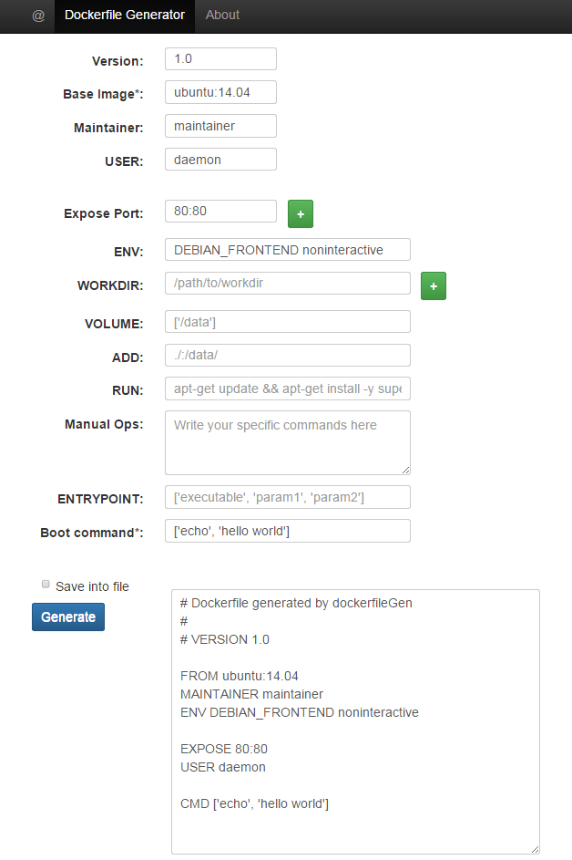

dockerfileGen
===

A smart web-based tool to generate best-practical Dockerfile based on user input information.

Thanks all [contributors](https://github.com/yeasy/dockerfileGen/graphs/contributors).

## Revision History
* v0.1: 2015-06-12
    * Finish the basic framework

## Feature
* Open to use without any third-party lib
* Automatically format and adjust the Dockerfile instructions
* Download the generated Dockerfile (TODO)

## Installation

```sh
git clone https://github.com/yeasy/dockerfileGen.git
```

Then open `index.html` using any web browser ([Google Chrome](http://www.google.com/chrome/) is recommended).


## Snapshot
.


## Design

### Philosophies
* Keep it simple, and open for use.
* Reduce human efforts.

### Techniques
* [Bootstrap 3](http://getbootstrap.com)


## Contribution

### Steps
* Fork the project as your own repository, e.g., `user/dockerfileGen`, then clone it to local server and set basic information.
```
$ git clone git@github.com:user/dockerfileGen.git
$ cd dockerfileGen
$ git config user.name "User"
$ git config user.email user@email.com
```

* Do some change and the commit to your own repository.
```
$ git commit -am "Fix issue #1: change helo to hello"
$ git push
```

* Send a PR (Pull Request) in the Github website.
* Keep synchronized with the official repository.
```
$ git remote add upstream https://github.com/yeasy/dockerfileGen
$ git fetch upstream
$ git checkout master
$ git rebase upstream/master
$ git push -f origin master
```
